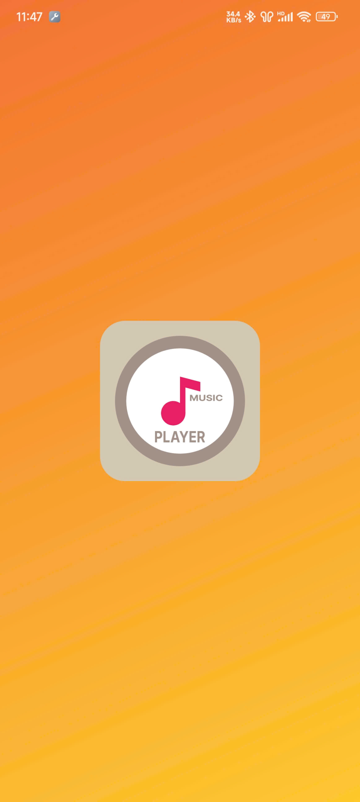

# Media Player Application

Welcome to **Media Player**, a modern and feature-rich media player that lets you enjoy your music and videos seamlessly. Below are some screenshots and a demo video of the application.

## Features
- Play audio and video files in various formats.
- Create and manage playlists.
- Support for subtitles and audio tracks.
- Customizable UI themes.
- Equalizer and sound effects.

## Screenshots

Here are a few screenshots of the Media Player app in action:

### Main Interface

### Playlist View
&nbsp;&nbsp;&nbsp;&nbsp;

### Now Playing Screen

## Demo Video

Check out the demo video below to see the app in action:

Click on the image above or [here](https://www.youtube.com/watch?v=YOUR_VIDEO_LINK) to watch the full demo on YouTube.

## Installation

To run this application, follow the steps below:
1. Clone the repository.
2. Install dependencies.
3. Build and run the project.

## License
This project is licensed under the MIT License - see the [LICENSE](LICENSE) file for details.
